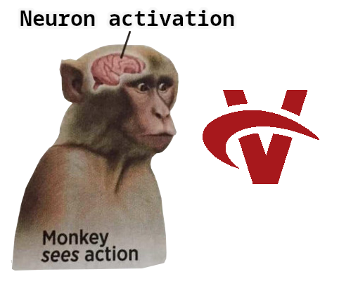

# Ape Vulkan ICD <a href="https://git.kbz8.me/kbz_8/VulkanDriver/actions?workflows=Build.yml"></a> <a href="https://git.kbz8.me/kbz_8/VulkanDriver/actions?workflows=Test.yml"></a>



For I feel as an ape, smiting sticks together in the vain hope of forging a driver.

Here lies the source code of a rather calamitous attempt at the Vulkan specification, shaped into an Installable Client Driver all written in Zig.

It was forged for my own learning and amusement alone. Pray, do not wield it in any earnest project, lest thy hopes and frame rates both find themselves entombed.

## Purpose

To understand Vulkan - not as a humble API mere mortals call upon, but as a labyrinthine system where one may craft a driver by hand.
It does not seek to produce a performant or production-worthy driver. \
*The gods are merciful, but not that merciful.*

## Soft [software]

Soft be a software implementation of the Vulkan specification, abiding within this driver's own codebase.\
It maketh use of a bespoke [SPIR-V interpreter](https://git.kbz8.me/kbz_8/SPIRV-Interpreter) and renderer, by whose workings its labours are carried forth.

### Build

If thou art truly determined:
```
zig build soft --release=[fast|safe|small]
```

And should thou seek additional build options with:
```
zig build --help
```

Then ensure thy Vulkan loader is pointed toward the ICD manifest.
The precise ritual varies by system - consult the tomes of your operating system, or wander the web's endless mausoleum of documentation.

Use at your own risk. If thy machine shudders, weeps, or attempts to flee - know that it was warned.

#### Vulkan 1.0 specification
<details>
    <summary>
        The present standing of thy Vulkan 1.0 specification's implementation
    </summary>

\
⚠️ Implemented, yet perchance not fully tested nor proven conformant, but rather working in a manner most general to thee and thine.\
Assume thou that functions lacking in this array are, for now, not intended to be wrought.

Name                                             | Status
-------------------------------------------------|--------
vkAcquireNextImage2KHR                           | ✅ Implemented
vkAcquireNextImageKHR                            | ✅ Implemented
vkAllocateCommandBuffers                         | ✅ Implemented
vkAllocateDescriptorSets                         | ✅ Implemented
vkAllocateMemory                                 | ✅ Implemented
vkBeginCommandBuffer                             | ✅ Implemented
vkBindBufferMemory                               | ✅ Implemented
vkBindImageMemory                                | ✅ Implemented
vkCmdBeginQuery                                  | ✅ Implemented
vkCmdBeginRenderPass                             | ✅ Implemented
vkCmdBindDescriptorSets                          | ✅ Implemented
vkCmdBindIndexBuffer                             | ✅ Implemented
vkCmdBindPipeline                                | ✅ Implemented
vkCmdBindVertexBuffers                           | ✅ Implemented
vkCmdBlitImage                                   | ✅ Implemented
vkCmdClearAttachments                            | ✅ Implemented
vkCmdClearColorImage                             | ✅ Implemented
vkCmdClearDepthStencilImage                      | ✅ Implemented
vkCmdCopyBuffer                                  | ✅ Implemented
vkCmdCopyBufferToImage                           | ✅ Implemented
vkCmdCopyImage                                   | ✅ Implemented
vkCmdCopyImageToBuffer                           | ✅ Implemented
vkCmdCopyQueryPoolResults                        | ✅ Implemented
vkCmdDispatch                                    | ✅ Implemented
vkCmdDispatchBaseKHR                             | ✅ Implemented
vkCmdDispatchIndirect                            | ✅ Implemented
vkCmdDraw                                        | ✅ Implemented
vkCmdDrawIndexed                                 | ✅ Implemented
vkCmdDrawIndexedIndirect                         | ✅ Implemented
vkCmdDrawIndirect                                | ✅ Implemented
vkCmdEndQuery                                    | ✅ Implemented
vkCmdEndRenderPass                               | ✅ Implemented
vkCmdExecuteCommands                             | ✅ Implemented
vkCmdFillBuffer                                  | ✅ Implemented
vkCmdNextSubpass                                 | ✅ Implemented
vkCmdPipelineBarrier                             | ✅ Implemented
vkCmdPushConstants                               | ✅ Implemented
vkCmdResetEvent                                  | ✅ Implemented
vkCmdResetQueryPool                              | ✅ Implemented
vkCmdResolveImage                                | ✅ Implemented
vkCmdSetBlendConstants                           | ✅ Implemented
vkCmdSetDepthBias                                | ✅ Implemented
vkCmdSetDepthBounds                              | ✅ Implemented
vkCmdSetDeviceMaskKHR                            | ✅ Implemented
vkCmdSetEvent                                    | ✅ Implemented
vkCmdSetLineWidth                                | ✅ Implemented
vkCmdSetScissor                                  | ✅ Implemented
vkCmdSetStencilCompareMask                       | ✅ Implemented
vkCmdSetStencilReference                         | ✅ Implemented
vkCmdSetStencilWriteMask                         | ✅ Implemented
vkCmdSetViewport                                 | ✅ Implemented
vkCmdUpdateBuffer                                | ✅ Implemented
vkCmdWaitEvents                                  | ✅ Implemented
vkCmdWriteTimestamp                              | ✅ Implemented
vkCreateBuffer                                   | ✅ Implemented
vkCreateBufferView                               | ✅ Implemented
vkCreateCommandPool                              | ✅ Implemented
vkCreateComputePipelines                         | ✅ Implemented
vkCreateDescriptorPool                           | ✅ Implemented
vkCreateDescriptorSetLayout                      | ✅ Implemented
vkCreateDevice                                   | ✅ Implemented
vkCreateEvent                                    | ✅ Implemented
vkCreateFence                                    | ✅ Implemented
vkCreateFramebuffer                              | ✅ Implemented
vkCreateGraphicsPipelines                        | ✅ Implemented
vkCreateImage                                    | ✅ Implemented
vkCreateImageView                                | ✅ Implemented
vkCreateInstance                                 | ✅ Implemented
vkCreatePipelineCache                            | ✅ Implemented
vkCreatePipelineLayout                           | ✅ Implemented
vkCreateQueryPool                                | ✅ Implemented
vkCreateRenderPass                               | ✅ Implemented
vkCreateSampler                                  | ✅ Implemented
vkCreateSemaphore                                | ✅ Implemented
vkCreateShaderModule                             | ✅ Implemented
vkCreateSwapchainKHR                             | ✅ Implemented
vkCreateWaylandSurfaceKHR                        | ✅ Implemented
vkCreateWin32SurfaceKHR                          | ⚙️ WIP
vkCreateXcbSurfaceKHR                            | ⚙️ WIP
vkCreateXlibSurfaceKHR                           | ⚙️ WIP
vkDestroyBuffer                                  | ✅ Implemented
vkDestroyBufferView                              | ✅ Implemented
vkDestroyCommandPool                             | ✅ Implemented
vkDestroyDescriptorPool                          | ✅ Implemented
vkDestroyDescriptorSetLayout                     | ✅ Implemented
vkDestroyDevice                                  | ✅ Implemented
vkDestroyEvent                                   | ✅ Implemented
vkDestroyFence                                   | ✅ Implemented
vkDestroyFramebuffer                             | ✅ Implemented
vkDestroyImage                                   | ✅ Implemented
vkDestroyImageView                               | ✅ Implemented
vkDestroyInstance                                | ✅ Implemented
vkDestroyPipeline                                | ✅ Implemented
vkDestroyPipelineCache                           | ✅ Implemented
vkDestroyPipelineLayout                          | ✅ Implemented
vkDestroyQueryPool                               | ✅ Implemented
vkDestroyRenderPass                              | ✅ Implemented
vkDestroySampler                                 | ✅ Implemented
vkDestroySemaphore                               | ✅ Implemented
vkDestroyShaderModule                            | ✅ Implemented
vkDestroySurfaceKHR                              | ✅ Implemented
vkDestroySwapchainKHR                            | ✅ Implemented
vkDeviceWaitIdle                                 | ✅ Implemented
vkEndCommandBuffer                               | ✅ Implemented
vkEnumerateDeviceExtensionProperties             | ✅ Implemented
vkEnumerateDeviceLayerProperties                 | ✅ Implemented
vkEnumerateInstanceExtensionProperties           | ✅ Implemented
vkEnumerateInstanceLayerProperties               | ✅ Implemented
vkEnumeratePhysicalDeviceGroupsKHR               | ✅ Implemented
vkEnumeratePhysicalDevices                       | ✅ Implemented
vkFlushMappedMemoryRanges                        | ✅ Implemented
vkFreeCommandBuffers                             | ✅ Implemented
vkFreeDescriptorSets                             | ✅ Implemented
vkFreeMemory                                     | ✅ Implemented
vkGetBufferDeviceAddress                         | ✅ Implemented
vkGetBufferDeviceAddressEXT                      | ✅ Implemented
vkGetBufferDeviceAddressKHR                      | ✅ Implemented
vkGetBufferMemoryRequirements                    | ✅ Implemented
vkGetDeviceGroupPeerMemoryFeaturesKHR            | ✅ Implemented
vkGetDeviceGroupPresentCapabilitiesKHR           | ✅ Implemented
vkGetDeviceGroupSurfacePresentModesKHR           | ✅ Implemented
vkGetDeviceMemoryCommitment                      | ✅ Implemented
vkGetDeviceProcAddr                              | ✅ Implemented
vkGetDeviceQueue                                 | ✅ Implemented
vkGetEventStatus                                 | ✅ Implemented
vkGetFenceStatus                                 | ✅ Implemented
vkGetImageMemoryRequirements                     | ✅ Implemented
vkGetImageSparseMemoryRequirements               | ❎ Unsupported
vkGetImageSubresourceLayout                      | ✅ Implemented
vkGetInstanceProcAddr                            | ✅ Implemented
vkGetPhysicalDeviceFeatures                      | ✅ Implemented
vkGetPhysicalDeviceFormatProperties              | ✅ Implemented
vkGetPhysicalDeviceImageFormatProperties         | ✅ Implemented
vkGetPhysicalDeviceMemoryProperties              | ✅ Implemented
vkGetPhysicalDeviceProperties                    | ✅ Implemented
vkGetPhysicalDeviceQueueFamilyProperties         | ✅ Implemented
vkGetPhysicalDeviceSparseImageFormatProperties   | ❎ Unsupported
vkGetPhysicalDeviceSurfaceCapabilitiesKHR        | ✅ Implemented
vkGetPhysicalDeviceSurfaceFormatsKHR             | ✅ Implemented
vkGetPhysicalDeviceSurfacePresentModesKHR        | ✅ Implemented
vkGetPhysicalDeviceSurfaceSupportKHR             | ✅ Implemented
vkGetPhysicalDeviceWaylandPresentationSupportKHR | ✅ Implemented
vkGetPhysicalDeviceWin32PresentationSupportKHR   | ⚙️ WIP
vkGetPhysicalDeviceXcbPresentationSupportKHR     | ⚙️ WIP
vkGetPhysicalDeviceXlibPresentationSupportKHR    | ⚙️ WIP
vkGetPipelineCacheData                           | ✅ Implemented
vkGetQueryPoolResults                            | ✅ Implemented
vkGetRenderAreaGranularity                       | ✅ Implemented
vkGetSwapchainImagesKHR                          | ✅ Implemented
vkInvalidateMappedMemoryRanges                   | ✅ Implemented
vkMapMemory                                      | ✅ Implemented
vkMergePipelineCaches                            | ✅ Implemented
vkQueueBindSparse                                | ❎ Unsupported
vkQueuePresentKHR                                | ✅ Implemented
vkQueueSubmit                                    | ✅ Implemented
vkQueueWaitIdle                                  | ✅ Implemented
vkResetCommandBuffer                             | ✅ Implemented
vkResetCommandPool                               | ✅ Implemented
vkResetDescriptorPool                            | ✅ Implemented
vkResetEvent                                     | ✅ Implemented
vkResetFences                                    | ✅ Implemented
vkResetQueryPool                                 | ✅ Implemented
vkSetEvent                                       | ✅ Implemented
vkUnmapMemory                                    | ✅ Implemented
vkUpdateDescriptorSets                           | ✅ Implemented
vkWaitForFences                                  | ✅ Implemented
</details>

[Here](https://vulkan-driver.kbz8.me/cts/soft/) shalt thou find a most meticulous account of the Vulkan 1.0 conformance trials, set forth for thy scrutiny.

## Phi [Xeon Phi KNC]

Phi be an implementation of the Vulkan specification, wrought for the Xeon Phi Knights Corner cards.
Whether the Knights Landing cards shall one day receive the same providence remaineth to be seen.

### Build

If thou art truly determined:
```
zig build phi --release=[fast|safe|small]
```

And should thou seek additional build options with:
```
zig build --help
```

The same rites apply as for the Soft build.

#### Vulkan 1.0 specification
<details>
    <summary>
        Here standeth the present reckoning of thy Vulkan 1.0 implementation
    </summary>

\
⚠️ Implemented, yet perchance not fully tested nor proven conformant, but rather working in a manner most general to thee and thine.\
Assume thou that functions lacking in this array are, for now, not intended to be wrought.

Name                                             | Status
-------------------------------------------------|--------
vkAcquireNextImage2KHR                           | ⚙️ WIP
vkAcquireNextImageKHR                            | ⚙️ WIP
vkAllocateCommandBuffers                         | ⚙️ WIP
vkAllocateDescriptorSets                         | ⚙️ WIP
vkAllocateMemory                                 | ✅ Implemented
vkBeginCommandBuffer                             | ⚙️ WIP
vkBindBufferMemory                               | ⚙️ WIP
vkBindImageMemory                                | ⚙️ WIP
vkCmdBeginQuery                                  | ⚙️ WIP
vkCmdBeginRenderPass                             | ⚙️ WIP
vkCmdBindDescriptorSets                          | ⚙️ WIP
vkCmdBindIndexBuffer                             | ⚙️ WIP
vkCmdBindPipeline                                | ⚙️ WIP
vkCmdBindVertexBuffers                           | ⚙️ WIP
vkCmdBlitImage                                   | ⚙️ WIP
vkCmdClearAttachments                            | ⚙️ WIP
vkCmdClearColorImage                             | ⚙️ WIP
vkCmdClearDepthStencilImage                      | ⚙️ WIP
vkCmdCopyBuffer                                  | ⚙️ WIP
vkCmdCopyBufferToImage                           | ⚙️ WIP
vkCmdCopyImage                                   | ⚙️ WIP
vkCmdCopyImageToBuffer                           | ⚙️ WIP
vkCmdCopyQueryPoolResults                        | ⚙️ WIP
vkCmdDispatch                                    | ⚙️ WIP
vkCmdDispatchBaseKHR                             | ⚙️ WIP
vkCmdDispatchIndirect                            | ⚙️ WIP
vkCmdDraw                                        | ⚙️ WIP
vkCmdDrawIndexed                                 | ⚙️ WIP
vkCmdDrawIndexedIndirect                         | ⚙️ WIP
vkCmdDrawIndirect                                | ⚙️ WIP
vkCmdEndQuery                                    | ⚙️ WIP
vkCmdEndRenderPass                               | ⚙️ WIP
vkCmdExecuteCommands                             | ⚙️ WIP
vkCmdFillBuffer                                  | ⚙️ WIP
vkCmdNextSubpass                                 | ⚙️ WIP
vkCmdPipelineBarrier                             | ⚙️ WIP
vkCmdPushConstants                               | ⚙️ WIP
vkCmdResetEvent                                  | ⚙️ WIP
vkCmdResetQueryPool                              | ⚙️ WIP
vkCmdResolveImage                                | ⚙️ WIP
vkCmdSetBlendConstants                           | ⚙️ WIP
vkCmdSetDepthBias                                | ⚙️ WIP
vkCmdSetDepthBounds                              | ⚙️ WIP
vkCmdSetDeviceMaskKHR                            | ⚙️ WIP
vkCmdSetEvent                                    | ⚙️ WIP
vkCmdSetLineWidth                                | ⚙️ WIP
vkCmdSetScissor                                  | ⚙️ WIP
vkCmdSetStencilCompareMask                       | ⚙️ WIP
vkCmdSetStencilReference                         | ⚙️ WIP
vkCmdSetStencilWriteMask                         | ⚙️ WIP
vkCmdSetViewport                                 | ⚙️ WIP
vkCmdUpdateBuffer                                | ⚙️ WIP
vkCmdWaitEvents                                  | ⚙️ WIP
vkCmdWriteTimestamp                              | ⚙️ WIP
vkCreateBuffer                                   | ⚙️ WIP
vkCreateBufferView                               | ⚙️ WIP
vkCreateCommandPool                              | ⚙️ WIP
vkCreateComputePipelines                         | ⚙️ WIP
vkCreateDescriptorPool                           | ⚙️ WIP
vkCreateDescriptorSetLayout                      | ⚙️ WIP
vkCreateDevice                                   | ✅ Implemented
vkCreateEvent                                    | ⚙️ WIP
vkCreateFence                                    | ⚙️ WIP
vkCreateFramebuffer                              | ⚙️ WIP
vkCreateGraphicsPipelines                        | ⚙️ WIP
vkCreateImage                                    | ⚙️ WIP
vkCreateImageView                                | ⚙️ WIP
vkCreateInstance                                 | ✅ Implemented
vkCreatePipelineCache                            | ⚙️ WIP
vkCreatePipelineLayout                           | ⚙️ WIP
vkCreateQueryPool                                | ⚙️ WIP
vkCreateRenderPass                               | ⚙️ WIP
vkCreateSampler                                  | ⚙️ WIP
vkCreateSemaphore                                | ⚙️ WIP
vkCreateShaderModule                             | ⚙️ WIP
vkCreateSwapchainKHR                             | ⚙️ WIP
vkCreateWaylandSurfaceKHR                        | ⚙️ WIP
vkCreateWin32SurfaceKHR                          | ⚙️ WIP
vkCreateXcbSurfaceKHR                            | ⚙️ WIP
vkCreateXlibSurfaceKHR                           | ⚙️ WIP
vkDestroyBuffer                                  | ⚙️ WIP
vkDestroyBufferView                              | ⚙️ WIP
vkDestroyCommandPool                             | ⚙️ WIP
vkDestroyDescriptorPool                          | ⚙️ WIP
vkDestroyDescriptorSetLayout                     | ⚙️ WIP
vkDestroyDevice                                  | ✅ Implemented
vkDestroyEvent                                   | ⚙️ WIP
vkDestroyFence                                   | ⚙️ WIP
vkDestroyFramebuffer                             | ⚙️ WIP
vkDestroyImage                                   | ⚙️ WIP
vkDestroyImageView                               | ⚙️ WIP
vkDestroyInstance                                | ✅ Implemented
vkDestroyPipeline                                | ⚙️ WIP
vkDestroyPipelineCache                           | ⚙️ WIP
vkDestroyPipelineLayout                          | ⚙️ WIP
vkDestroyQueryPool                               | ⚙️ WIP
vkDestroyRenderPass                              | ⚙️ WIP
vkDestroySampler                                 | ⚙️ WIP
vkDestroySemaphore                               | ⚙️ WIP
vkDestroyShaderModule                            | ⚙️ WIP
vkDestroySurfaceKHR                              | ⚙️ WIP
vkDestroySwapchainKHR                            | ⚙️ WIP
vkDeviceWaitIdle                                 | ⚙️ WIP
vkEndCommandBuffer                               | ⚙️ WIP
vkEnumerateDeviceExtensionProperties             | ⚙️ WIP
vkEnumerateDeviceLayerProperties                 | ⚙️ WIP
vkEnumerateInstanceExtensionProperties           | ⚙️ WIP
vkEnumerateInstanceLayerProperties               | ⚙️ WIP
vkEnumeratePhysicalDeviceGroupsKHR               | ⚙️ WIP
vkEnumeratePhysicalDevices                       | ✅ Implemented
vkFlushMappedMemoryRanges                        | ⚙️ WIP
vkFreeCommandBuffers                             | ⚙️ WIP
vkFreeDescriptorSets                             | ⚙️ WIP
vkFreeMemory                                     | ✅ Implemented
vkGetBufferDeviceAddress                         | ⚙️ WIP
vkGetBufferDeviceAddressEXT                      | ⚙️ WIP
vkGetBufferDeviceAddressKHR                      | ⚙️ WIP
vkGetBufferMemoryRequirements                    | ⚙️ WIP
vkGetDeviceGroupPeerMemoryFeaturesKHR            | ⚙️ WIP
vkGetDeviceGroupPresentCapabilitiesKHR           | ⚙️ WIP
vkGetDeviceGroupSurfacePresentModesKHR           | ⚙️ WIP
vkGetDeviceMemoryCommitment                      | ⚙️ WIP
vkGetDeviceProcAddr                              | ⚙️ WIP
vkGetDeviceQueue                                 | ⚙️ WIP
vkGetEventStatus                                 | ⚙️ WIP
vkGetFenceStatus                                 | ⚙️ WIP
vkGetImageMemoryRequirements                     | ⚙️ WIP
vkGetImageSparseMemoryRequirements               | ⚙️ WIP
vkGetImageSubresourceLayout                      | ⚙️ WIP
vkGetInstanceProcAddr                            | ⚙️ WIP
vkGetPhysicalDeviceFeatures                      | ✅ Implemented
vkGetPhysicalDeviceFormatProperties              | ⚙️ WIP
vkGetPhysicalDeviceImageFormatProperties         | ⚙️ WIP
vkGetPhysicalDeviceMemoryProperties              | ✅ Implemented
vkGetPhysicalDeviceProperties                    | ✅ Implemented
vkGetPhysicalDeviceQueueFamilyProperties         | ⚙️ WIP
vkGetPhysicalDeviceSparseImageFormatProperties   | ⚙️ WIP
vkGetPhysicalDeviceSurfaceCapabilitiesKHR        | ⚙️ WIP
vkGetPhysicalDeviceSurfaceFormatsKHR             | ⚙️ WIP
vkGetPhysicalDeviceSurfacePresentModesKHR        | ⚙️ WIP
vkGetPhysicalDeviceSurfaceSupportKHR             | ⚙️ WIP
vkGetPhysicalDeviceWaylandPresentationSupportKHR | ⚙️ WIP
vkGetPhysicalDeviceWin32PresentationSupportKHR   | ⚙️ WIP
vkGetPhysicalDeviceXcbPresentationSupportKHR     | ⚙️ WIP
vkGetPhysicalDeviceXlibPresentationSupportKHR    | ⚙️ WIP
vkGetPipelineCacheData                           | ⚙️ WIP
vkGetQueryPoolResults                            | ⚙️ WIP
vkGetRenderAreaGranularity                       | ⚙️ WIP
vkGetSwapchainImagesKHR                          | ⚙️ WIP
vkInvalidateMappedMemoryRanges                   | ⚙️ WIP
vkMapMemory                                      | ⚙️ WIP
vkMergePipelineCaches                            | ⚙️ WIP
vkQueueBindSparse                                | ⚙️ WIP
vkQueuePresentKHR                                | ⚙️ WIP
vkQueueSubmit                                    | ⚙️ WIP
vkQueueWaitIdle                                  | ⚙️ WIP
vkResetCommandBuffer                             | ⚙️ WIP
vkResetCommandPool                               | ⚙️ WIP
vkResetDescriptorPool                            | ⚙️ WIP
vkResetEvent                                     | ⚙️ WIP
vkResetFences                                    | ⚙️ WIP
vkResetQueryPool                                 | ⚙️ WIP
vkSetEvent                                       | ⚙️ WIP
vkUnmapMemory                                    | ⚙️ WIP
vkUpdateDescriptorSets                           | ⚙️ WIP
vkWaitForFences                                  | ⚙️ WIP
</details>

## License

Released unto the world as MIT for study, experimentation, and the occasional horrified whisper.
Do with it as thou wilt, but accept the consequences as thine own.

## Mirrors

This codebase is maintained chiefly upon [mine own Git forge](https://git.kbz8.me/kbz_8/VulkanDriver), though thou may also find an active mirror upon [GitHub](https://github.com/Kbz-8/VulkanDriver).
